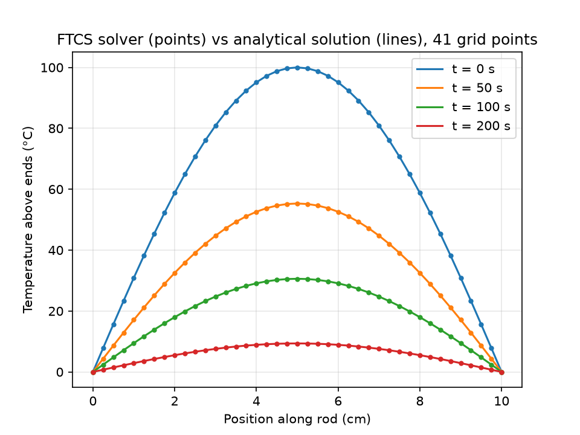
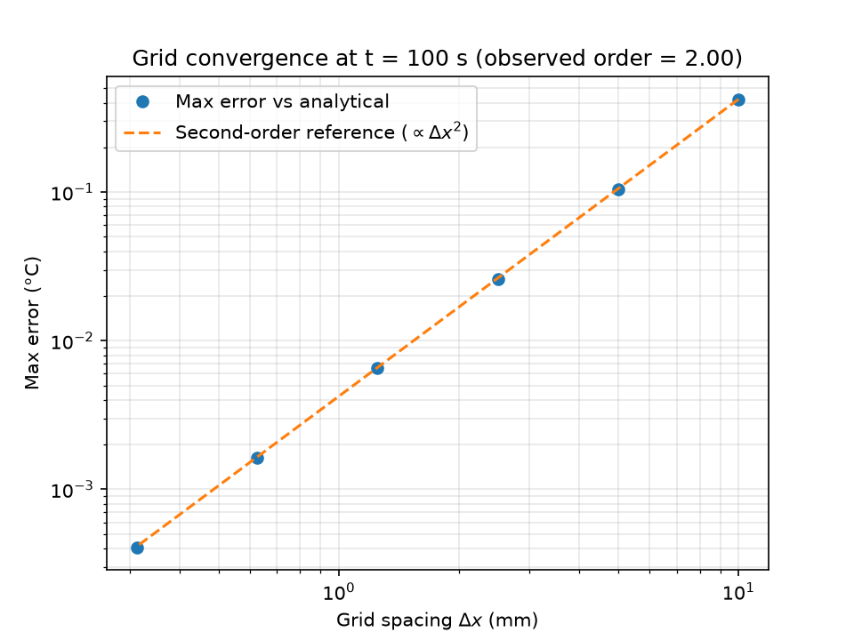
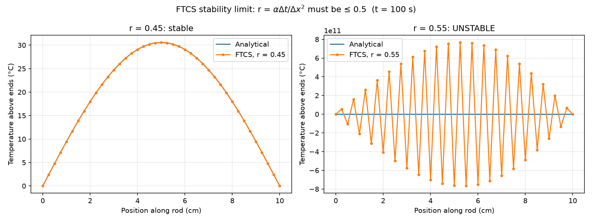

# 1D Heat Conduction Solver (FTCS)

A finite-difference solver for the 1D heat equation, ∂T/∂t = α ∂²T/∂x², using the FTCS (forward-time, centred-space) scheme. Verified against the analytical solution, with a grid convergence study and a demonstration of the stability limit.

## Problem

A 10 cm steel rod (α = 1.2 × 10⁻⁵ m²/s) starts with a sine-shaped temperature profile, peaking at 100 °C above the ends, with both ends held fixed. This case has an exact solution: the sine shape keeps its form and decays exponentially,

T(x, t) = 100 · sin(πx/L) · exp(−απ²t/L²)

so the numerical results can be checked against it directly.

## Method

The rod is split into evenly spaced grid points. At each time step, every interior point is updated from its two neighbours:

T_i(new) = T_i + r (T_(i+1) − 2T_i + T_(i−1)),  where r = αΔt/Δx²

Physically, each point moves towards the average of its neighbours: hot spots cool and cold spots warm.

## Results

### Comparison with the analytical solution

With 41 grid points, the numerical solution matches the analytical curves at every time shown, as the hot spot decays from 100 °C to about 9 °C after 200 s.

### Grid convergence

The grid was refined from 11 to 321 points, keeping r fixed at 0.4 (so the time step shrinks with Δx²). Each time the grid spacing is halved, the maximum error drops by a factor of 4.00, giving an observed order of accuracy of 2.00. This confirms the expected second-order accuracy, with the error falling from 0.42 °C on the coarsest grid to 0.0004 °C on the finest.

| Grid points | Δx (mm) | Max error (°C) | Ratio to previous |
|---|---|---|---|
| 11 | 10.0 | 4.23 × 10⁻¹ | – |
| 21 | 5.0 | 1.05 × 10⁻¹ | 4.04 |
| 41 | 2.5 | 2.61 × 10⁻² | 4.01 |
| 81 | 1.25 | 6.52 × 10⁻³ | 4.00 |
| 161 | 0.625 | 1.63 × 10⁻³ | 4.00 |
| 321 | 0.3125 | 4.08 × 10⁻⁴ | 4.00 |

### Stability limit

FTCS is only stable for r ≤ 0.5. At r = 0.45 the solution behaves normally. At r = 0.55 it blows up into a growing zigzag, reaching around 10¹¹ °C after 100 s. Each step multiplies the highest-frequency zigzag mode by |1 − 4r|. At r = 0.55 this is 1.2, so tiny rounding errors grow by 20% per step until they swamp the solution.

## Limitations

- 1D only, with constant material properties and fixed-temperature ends.
- FTCS is explicit, so the stability limit forces very small time steps on fine grids (Δt ∝ Δx²), which makes it slow for fine meshes.

## Next steps

- Implement the implicit Crank–Nicolson scheme, which is unconditionally stable, and compare run times
- Add other boundary conditions (insulated ends, convective cooling)
- Extend to 2D

## Files

- `solver.py` – FTCS solver and comparison with the analytical solution
- `convergence.py` – grid convergence study
- `stability.py` – demonstration of the stability limit

## How to run

Requires Python 3 with NumPy and Matplotlib.

    py solver.py
    py convergence.py
    py stability.py